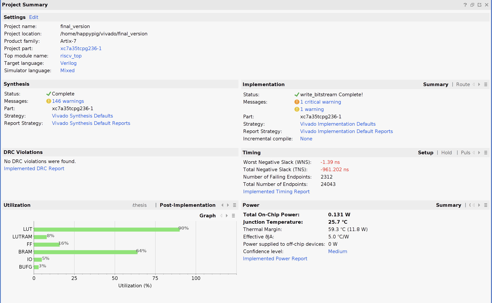
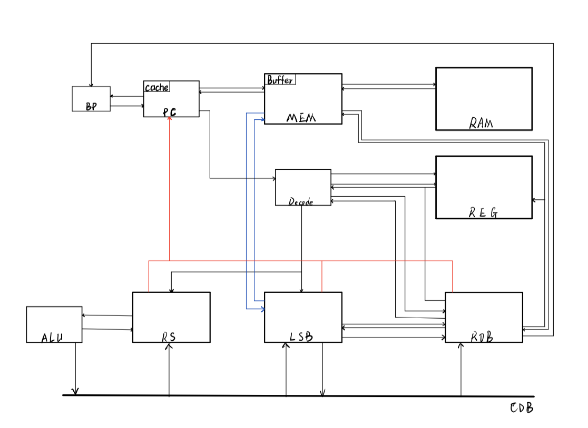
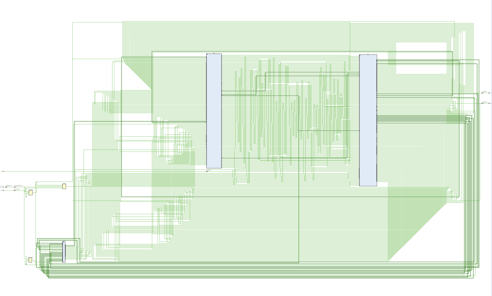

# Lightyear

> Run on XC7A35T-ICPG236C FPGA board

A toy CPU supporting part of RV32I Instruction set, implementing dynamic scheduling by tomasulo algorithm, providing speculation and precise exception. MS108 Course Project.


#### Feature

- [x] 16 entries RS, 16 entries LSB and 16 entries ROB
- [x] 255 entries direct-mapped i-cache supporting throughput of one instruction per cycle
- [x] 4 entries write buffer, providing *scary fast* memory performance
- [x] 255 entries 2-bit saturating counter branch predictor
- [x] LSB support incomplete order execution by checking RAW
- [ ] Multiple Issue 
- [ ] Add instruction queue


#### Performance

|        |    Pi    | Superloop | bulgarian | Basicopt1 |  Magic   |
| :----: | :------: | :-------: | :-------: | :-------: | :------: |
| Cycles |          |  1744345  |  6687495  |  2749293  | 5168865  |
| Time/s | 1.912046 | 0.021458  | 1.745739  | 0.027818  | 0.030861 |

> Cycles tested in simulation by adding \$display($time) in hci.v
>
> Time tested on 100Mhz FPGA board





#### Design schematic




#### Synthesis schematic




#### Repo Structure

```
📦CPU
 ┣ 📂doc                                      Files maybe help you
 ┣ 📂riscv
 ┃ ┣ 📂bin                                    .bin files compiled from testcases
 ┃ ┣ 📂bin_without_in                         .bin files compiled from testcases modified without input
 ┃ ┣ 📂ctrl                                   Interface with FPGA
 ┃ ┣ 📂sim                                    Testbench, add to Vivado project only in simulation
 ┃ ┣ 📂src                                    My code
 ┃ ┃ ┣ 📂common                               Provided UART and RAM
 ┃ ┃ ┃ ┣ 📂block_ram                          RAM
 ┃ ┃ ┃ ┣ 📂fifo                               FIFO queue for io buffer
 ┃ ┃ ┃ ┗ 📂uart                               Universal Asynchronous Receiver/Transmitter
 ┃ ┃ ┣ 📜Basys-3-Master.xdc                   Constraint file provided for creating project in vivado
 ┃ ┃ ┣ 📜alu.v                                Arithmetic logic unit
 ┃ ┃ ┣ 📜bp.v                                 BTB Branch Prediction
 ┃ ┃ ┣ 📜constant.v                           Defines statement
 ┃ ┃ ┣ 📜cpu.v                                Connect all submodule together
 ┃ ┃ ┣ 📜decode.v                             Combinatorial logic for instruction decode
 ┃ ┃ ┣ 📜fetcher.v                            PC/IF/i-cache
 ┃ ┃ ┣ 📜hci.v                                A data bus between UART/RAM and CPU
 ┃ ┃ ┣ 📜lsb.v                                Load store buffer
 ┃ ┃ ┣ 📜memCtrl.v                            Interface with RAM, deal with structure hazard
 ┃ ┃ ┣ 📜ram.v                                RAM
 ┃ ┃ ┣ 📜registers.v                          Register file
 ┃ ┃ ┣ 📜riscv_top.v                          Top design
 ┃ ┃ ┣ 📜rob.v                                Reorder buffer
 ┃ ┃ ┗ 📜rs.v                                 Reservation station
 ┃ ┣ 📂sys                                    Help compile, includes io.h
 ┃ ┣ 📂testcase                               Testcases from TA
 ┃ ┣ 📜FPGA_test.py                           Test correctness on FPGA
 ┃ ┣ 📜FPGA_test_without_tool_chain.py        My script using compiled .bin to test
 ┃ ┣ 📜autorun_fpga.sh                        Component of FPGA_test.py
 ┃ ┣ 📜autorun_fpga_without_tool_chain.sh     Component of FPGA_test_without_tool_chain.py
 ┃ ┣ 📜build_test.sh                          Run it to build test.data and test.bin from test.c
 ┃ ┣ 📜generate_bin.py                        My script used to generate all .bin
 ┃ ┣ 📜generate_bin_bash.sh                   Component of generate_bin.py
 ┃ ┣ 📜my_check_test.sh                       My script runs test and diff output with .ans
 ┃ ┣ 📜my_run_test.sh                         My script used to run simulation test
 ┃ ┣ 📜run_test.sh                            Run test
 ┃ ┗ 📜run_test_fpga.sh                       Run specific test on FPGA
 ┣ 📜README.md
 ┗ 📜serial.zip                               A third-party library for interfacing with FPGA ports
```